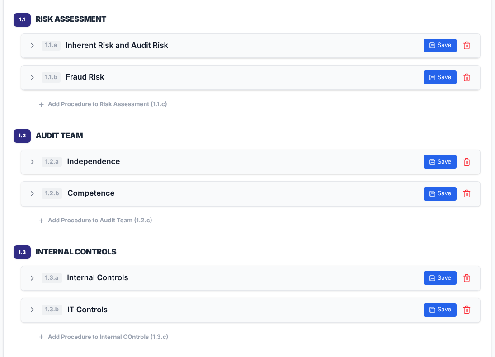
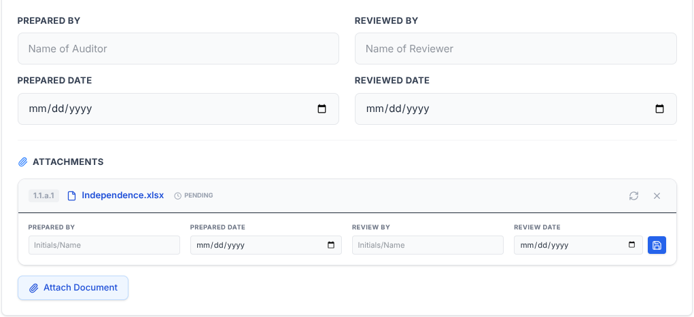
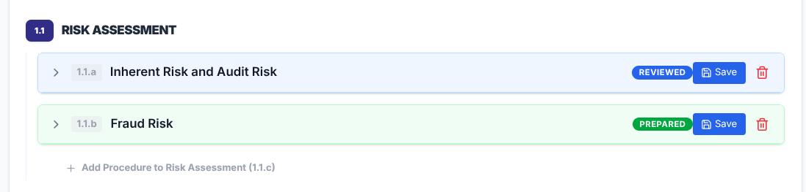
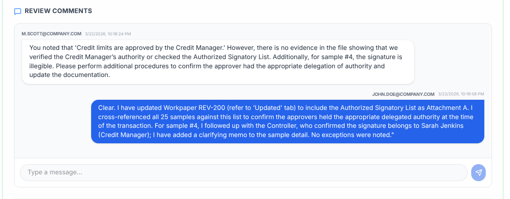

# AMSOS: Audit Management Software Open Source


*Central Dashboard providing a high-level overview of active audits, project status, and quick access to administrative tools.*

AMSOS is a simple, modern, and open-source web application designed for auditors to document audit programs and procedures. It streamlines the audit lifecycle across Planning, Fieldwork, and Reporting phases with built-in sign-off tracking, reviewer collaboration, and professional document export.

Deploy AMSOS on your terms with complete infrastructure-agnostic flexibility. Our open-source architecture gives you the freedom to run the platform locally for private testing, self-host it within your own secure network for maximum data sovereignty, or scale easily in the cloud. By leveraging a fully containerized design, AMSOS ensures that you always retain full ownership of your sensitive audit data, regardless of where you choose to host it.

## 🌟 Background & Mission

The purpose of this project is to provide free, open-source audit management software to audit offices. 

This software was "vibe-coded" by a CPA with 10 years of audit experience who was looking for a free, open-source alternative to expensive proprietary solutions. We believe that high-quality audit tools should be accessible to every auditor, regardless of budget.

**Contributions are welcomed!** Whether you are an auditor with feature ideas or a developer looking to help, please feel free to open an issue or submit a pull request.


*Audit Detail View featuring milestone tracking, team member assignments, and phase-based procedure navigation.*

## 🚀 Key Features

*   **Project Dashboard**: Overview of all active audits with a dedicated **Completed Archival** section for finished projects.
*   **Three-Phase Workflow**: Standardized sections for Planning, Fieldwork, and Reporting.
*   **Audit Program Templates**: Create and manage a library of standard audit programs. Instantly import sets of procedures and purposes into any phase to standardize documentation and save time.
*   **Hierarchical Organization**: Organize procedures into **Procedure Groups** (e.g., "Payroll", "Revenue"). 
*   **Smart Numbering**: Automatic professional nomenclature (Groups: **1.1**, Procedures: **1.1.a**, Attachments: **1.1.a.1**).
*   **Comprehensive Documentation**: Each procedure tracks Purpose, Source, Scope, Methodology, Results, Conclusions, and **Reviewer Comments**.
*   **Audit Sign-offs**: "Prepared By" and "Reviewed By" tracking with dates and visual status badges.
*   **Attachment Support**: Attach PDF, Word, Excel, and PowerPoint documents directly to specific procedures. 
*   **Attachment Review**: Each individual attachment now supports its own "Prepared By" and "Reviewed By" sign-offs for granular quality control.
*   **Milestone Tracking**: Monitor key project dates and **attach a detailed milestones spreadsheet** for granular project management.
*   **Team Management**: Document audit team members, roles, and contact information.
*   **Professional Export**: Generate a complete "Audit Program" in Word (.docx) format with one click.
*   **Secure Access**: Built-in authentication with granular role-based access control and **Federal SSO (OIDC)** support.


*Hierarchical Organization using Procedure Groups to categorize complex audit fieldwork into logical folders.*


*Detailed Procedure Documentation including standardized fields for audit evidence and integrated sign-off tracking.*

## 🔐 Roles & Permissions (RBAC)

AMSOS uses a granular **Role-Based Access Control (RBAC)** model to ensure data integrity and proper audit oversight. Access is controlled at two levels: system-wide roles and audit-specific team assignments.

### System Roles

| Role | Capabilities |
| :--- | :--- |
| **Administrator** | Full system access. Can manage the user directory (add/import/delete users) and delete entire audits. |
| **Audit Partner** | Senior management role. Can create, edit, and sign off on any audit they are assigned to. |
| **Audit Director** | Senior management role. Can create, edit, and sign off on any audit they are assigned to. |
| **Audit Manager** | Management role. Can create, edit, and sign off on any audit they are assigned to. |
| **Auditor** | Standard role. Can document procedures, upload attachments, and sign off as a preparer. |
| **Specialist** | Contributor role. Can document procedures but is **restricted from deleting procedures** to protect data integrity. |

### Access Control Rules
*   **Audit Visibility**: Non-administrators can **only** see and access audits to which they have been explicitly added as a **Team Member**.
*   **Audit Deletion**: A safety-first approach restricts audit deletion strictly to the **Administrator** role.
*   **Review Workflow**: While any role can be assigned to an audit, typically senior roles (Partner, Director, Manager) perform the final "Reviewed By" sign-off.
*   **Audit Logs**: All sensitive actions (logins, deletions, user changes) are tracked in the system-wide Audit Logs for compliance.


*Granular Control with individual "Prepared" and "Reviewed" sign-offs for every procedure and supporting attachment.*


*Visual Status Tracking providing immediate insight into preparation and review progress across all procedures.*

## 🛠 Tech Stack

*   **Framework**: [Next.js](https://nextjs.org/) (React)
*   **Database**: SQLite (via [Prisma ORM](https://www.prisma.io/))
*   **Styling**: Tailwind CSS
*   **Auth**: JWT-based session management + OpenID Connect (OIDC)
*   **Export**: docx.js


*Reviewer Collaboration Tools featuring real-time comments and secure file attachments for comprehensive workpaper support.*

## 💻 Installation & Setup

### 🐳 Method 1: Docker (Production)
Docker is the preferred way to run AMSOS as it bundles all dependencies and ensures a consistent environment.

#### 1. Quick Start
You can build and run the application in a single step using the provided `Dockerfile`.

```bash
# Clone the repository
git clone https://github.com/Bobby10105/AMSOS.git
cd AMSOS

# Build the Docker image
docker build -t amsos .

# Create persistent volumes for the database and uploads
docker volume create amsos-uploads
docker volume create amsos-db

# Run the container
# Note: We mount the DB volume to a sub-folder to keep the app's schema file intact
docker run -d \
  -p 3000:3000 \
  -v amsos-uploads:/app/public/uploads \
  -v amsos-db:/app/prisma/data \
  -e DATABASE_URL="file:/app/prisma/data/dev.db" \
  -e JWT_SECRET="your-secure-secret-key" \
  --name amsos \
  amsos
```

#### ⚠️ MANDATORY: (JWT_SECRET) For production, replace "your-secure-secret-key" with a cryptographically secure 256-bit (32-byte) random seed, encoded as a Base64 string. 

#### Persistence Note
The `-v` flags ensure your audit data and file attachments are stored in persistent Docker volumes, allowing you to update the app image without losing data.

---

### 🏗 Method 2: Docker Compose (Development & Testing)
Use this method if you want to test changes in real-time. It uses a separate development configuration that mounts your local source code directly into the container.

```bash
# Build and start the development environment
docker compose up --build
```

**Features of the Dev Build:**
*   **Hot Reloading**: Any code changes you make locally are instantly reflected in the container.
*   **Real-time Logs**: See the server and database logs directly in your terminal.
*   **Automatic Setup**: Handles database pushes and seeding automatically on startup.
*   **Persistent Data**: Uses volumes to keep your test data and uploads even if you restart the container.

To stop the environment, use `docker compose down`.

---

### 🛠 Method 2: Manual Installation (Node.js)
If you prefer to run AMSOS directly on your host machine, follow these steps.

#### 1. Prerequisites

*   [Node.js](https://nodejs.org/) (v18 or later)
*   npm (installed with Node.js)

#### 2. Setup

```bash
# Clone the repository
git clone https://github.com/Bobby10105/AMSOS.git
cd AMSOS

# Install dependencies
npm install
```

#### 3. Environment Configuration

Prisma requires a `DATABASE_URL` to be defined before creating the database. You can quickly create a `.env` file with the following command:

```bash
cat << 'EOF' > .env
DATABASE_URL="file:./dev.db"

# MANDATORY: Change this to a random secure string for production
JWT_SECRET="your-secure-secret-key"

# (Optional) Federal SSO Configuration (OIDC)
# SSO_CLIENT_ID="your-client-id"
# SSO_CLIENT_SECRET="your-client-secret"
# SSO_ISSUER_URL="https://idp.agency.gov"
# NEXT_PUBLIC_BASE_URL="https://your-app-url.gov"
EOF
```

#### 4. Database Creation & Seeding

Once the `.env` file is ready, run the following to initialize your workspace:

```bash
# Create the database and sync the schema
npx prisma db push

# Create the initial admin user
npx prisma db seed
```

#### 5. Run the Application

```bash
# Start development server
npm run dev
```

Open [http://localhost:3000](http://localhost:3000) in your browser.

### Server Deployment (Production)

For a stable, 24/7 server setup, follow these production-ready steps:

#### Build the Application

Compile the TypeScript and React code into a production-ready bundle:
```bash
npm run build
```

#### Process Management (PM2)

It is recommended to use [PM2](https://pm2.keymetrics.io/) to keep the application running in the background and automatically restart it if it crashes.
```bash
# Install PM2 globally
npm install -g pm2

# Start the application
pm2 start npm --name "amsos" -- start

# Save the current process list
pm2 save

# ⚠️ Setup Automatic Reboot (Crucial Step)
# Running 'pm2 startup' will generate a specific command.
# You MUST copy that entire line from your terminal, paste it, and run it 
# (it will look like: sudo env PATH=$PATH:/home/user/bin /usr/lib/node_modules/pm2/bin/pm2 startup ...)
pm2 startup
```

---

### 🔑 Initial Login
Once the application is running (via Docker or Node.js), use the following default credentials to sign in:

*   **Username**: `admin`
*   **Password**: `admin`

**⚠️ Security Note:** Immediately after logging in, navigate to the **User Directory** to create your own administrative account and delete the default `admin` user, or change the default password via the profile menu.

#### 🔒 Reverse Proxy (Nginx)
For public access and SSL (HTTPS), use Nginx as a reverse proxy on port 80/443. A sample configuration:
```nginx
server {
    server_name your-app-url.gov;

    location / {
        proxy_pass http://localhost:3000;
        proxy_http_version 1.1;
        proxy_set_header Upgrade $http_upgrade;
        proxy_set_header Connection 'upgrade';
        proxy_set_header Host $host;
        proxy_cache_bypass $http_upgrade;
    }
    
    # Increase client body size for attachment uploads
    client_max_body_size 50M;
}
```

## 🛡 Security & Management

*   **Password Management**: Users can securely change their own passwords by clicking their profile icon in the navigation bar.
*   **User Directory**: Accessible to all users to view the team, but only **Administrators** can add, delete, or bulk-import users via CSV.
*   **Audit Logging**: Key actions (Logins, Deletions, User Changes) are tracked in the system Audit Logs.
*   **Audit Deletion**: Restricted to the **Administrator** role to prevent accidental data loss of official audit records.

## 📁 Project Structure

*   `/src/app`: Application routes, API endpoints, and SSO handlers.
*   `/src/components`: Reusable UI components (Procedures, Milestones, User Directory, etc.).
*   `/prisma`: Database schema and configuration.
*   `/public/uploads`: Local storage for audit procedure attachments.

## 🛡 Security & Responsibility
**The user is solely responsible for the security, configuration, and proper deployment of this software.** 

The authors and contributors accept **no responsibility** for security incidents, data breaches, data loss, or system failures. Users must ensure:
*   **Environment Security**: Always change the `JWT_SECRET` and secure your `.env` file.
*   **Configuration**: Proper server, network, and database configuration is required for safe operation.
*   **SSL/TLS**: Production environments must be deployed behind a secure reverse proxy with HTTPS enabled.
*   **SSO Callback**: Ensure your Identity Provider (IDP) is configured with the correct callback URL: `https://your-domain.com/api/auth/sso/callback`.

Please review the full [Disclaimer](DISCLAIMER.md) before use.

---
[License](LICENSE) | [Security Policy](SECURITY.md) | [Disclaimer](DISCLAIMER.md)
