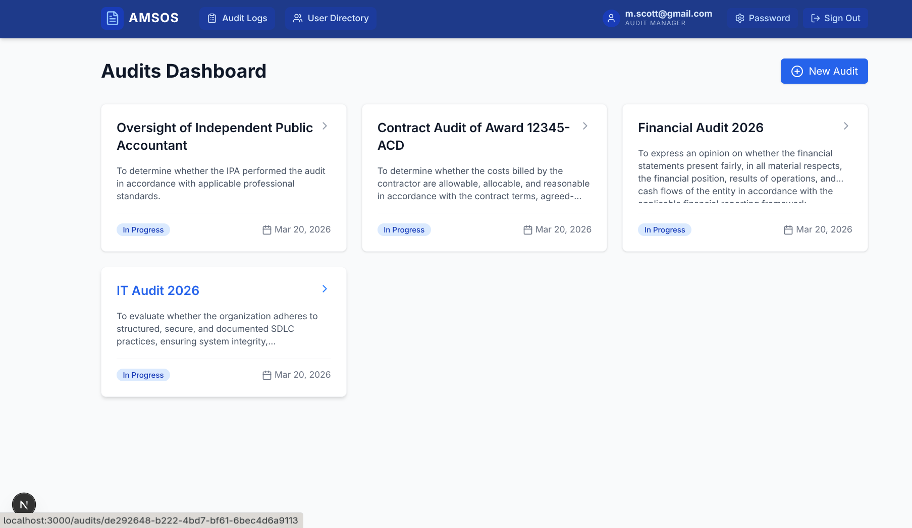
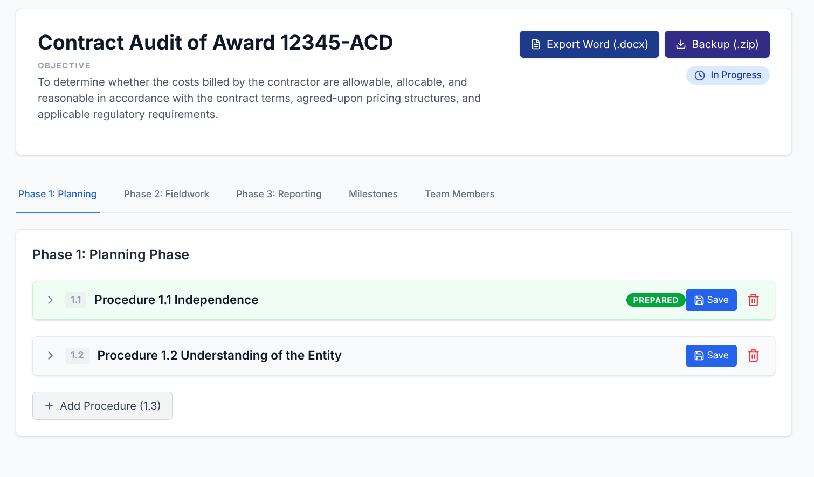
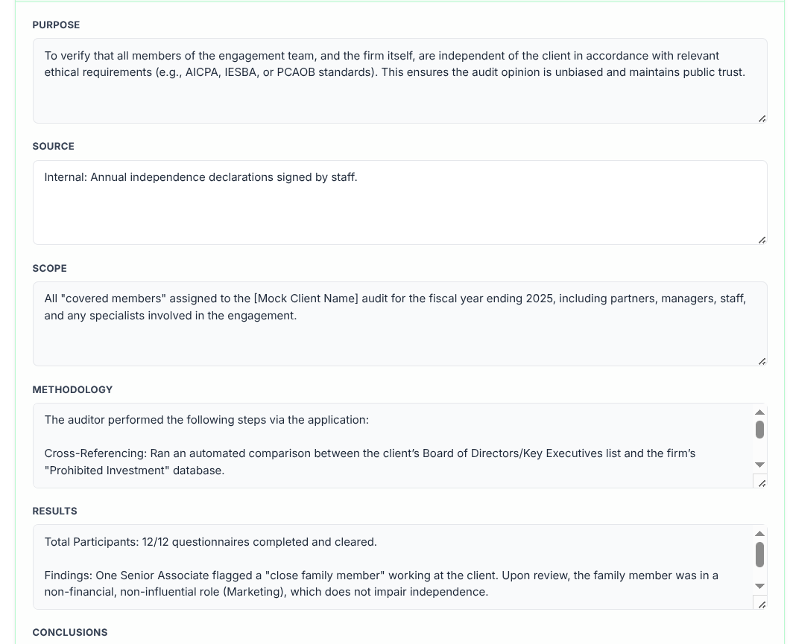
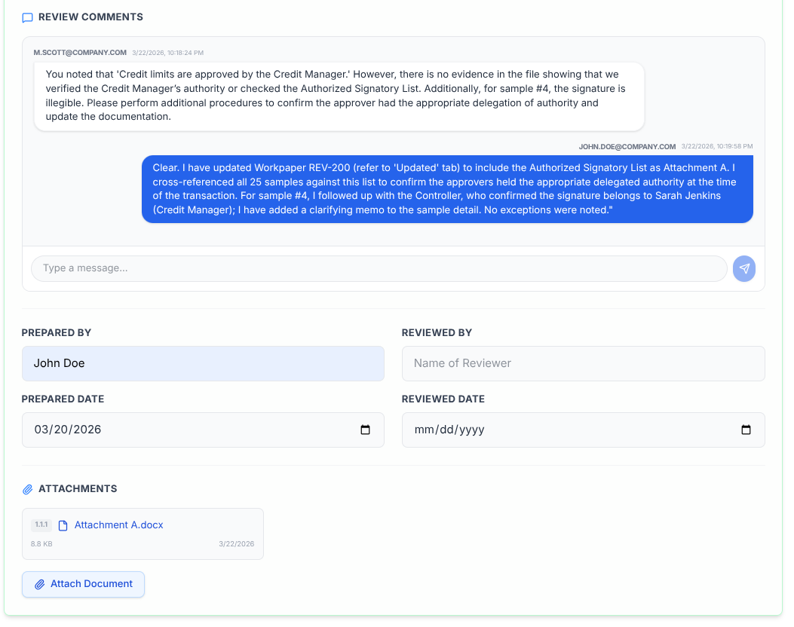

# AMSOS: Audit Management Software Open Source



AMSOS is a simple, modern, and open-source web application designed for auditors to document audit programs and procedures. It streamlines the audit lifecycle across Planning, Fieldwork, and Reporting phases with built-in sign-off tracking, reviewer collaboration, and professional document export.

## 🌟 Background & Mission

The purpose of this project is to provide free, open-source audit management software to audit offices worldwide. 

This software was "vibe-coded" by a CPA with 10 years of audit experience who was looking for a free, open-source alternative to expensive proprietary solutions. We believe that high-quality audit tools should be accessible to every auditor, regardless of budget.

**Contributions are welcomed!** Whether you are an auditor with feature ideas or a developer looking to help, please feel free to open an issue or submit a pull request.

## 🚀 Key Features

*   **Project Dashboard**: Overview of all active and completed audits.
*   **Three-Phase Workflow**: Standardized sections for Planning, Fieldwork, and Reporting.
*   **Comprehensive Documentation**: Each procedure tracks Purpose, Source, Scope, Methodology, Results, Conclusions, and **Reviewer Comments**.
*   **Audit Sign-offs**: "Prepared By" and "Reviewed By" tracking with dates and visual status badges (Green for Prepared, Blue for Reviewed).
*   **Milestone Tracking**: Monitor key project dates (Planning, Fieldwork Start/End, Report Issued).
*   **Team Management**: Document audit team members, roles, and contact information.
*   **Attachment Support**: Attach PDF, Word, Excel, and PowerPoint documents directly to specific procedures.
*   **Professional Export**: Generate a complete "Audit Program" in Word (.docx) format with one click.
*   **Secure Access**: Built-in authentication with granular role-based access control and **Federal SSO (OIDC)** support.



## 🔐 Roles & Permissions

AMSOS uses a tiered permission model to ensure data integrity and proper audit oversight:

| Role | Capabilities |
| :--- | :--- |
| **Administrator** | Full system access. Can manage the user directory, create/import users, and delete entire audits. |
| **Audit Manager** | Can create, edit, and sign off on audits. Full procedure management. |
| **Auditor** | Can document procedures, upload attachments, and sign off as a preparer. |
| **Specialist** | Can document procedures and sign off, but is **restricted from deleting procedures**. |



## 🛠 Tech Stack

*   **Framework**: [Next.js](https://nextjs.org/) (React)
*   **Database**: SQLite (via [Prisma ORM](https://www.prisma.io/))
*   **Styling**: Tailwind CSS
*   **Auth**: JWT-based session management + OpenID Connect (OIDC)
*   **Export**: docx.js



## 💻 Installation & Setup

### 1. Prerequisites
*   [Node.js](https://nodejs.org/) (v18 or later)
*   npm (installed with Node.js)

### 2. Setup
```bash
# Clone the repository
git clone https://github.com/bobbooshay/AMSOS.git
cd AMSOS

# Install dependencies
npm install

# Create the database and sync the schema
npx prisma db push

# Create the initial admin user (admin / admin)
npx prisma db seed
```

### 3. Environment Configuration
Create a `.env` file in the root directory:
```env
DATABASE_URL="file:./dev.db"
JWT_SECRET="your-secure-secret-key"

# (Optional) Federal SSO Configuration (OIDC)
SSO_CLIENT_ID="your-client-id"
SSO_CLIENT_SECRET="your-client-secret"
SSO_ISSUER_URL="https://idp.agency.gov"
NEXT_PUBLIC_BASE_URL="https://your-app-url.gov"
```

### 4. Run the Application
```bash
# Start development server
npm run dev
```
Open [http://localhost:3000](http://localhost:3000) in your browser.

### 5. Server Deployment (Production)
For a stable, 24/7 server setup, follow these production-ready steps:

#### Build the Application
Compile the TypeScript and React code into a production-ready bundle:
```bash
npm run build
```

#### Process Management (PM2)
It is recommended to use [PM2](https://pm2.keymetrics.io/) to keep the application running in the background and automatically restart it if it crashes.
```bash
# Install PM2 globally
npm install -g pm2

# Start the application
pm2 start npm --name "amsos" -- start

# Ensure it starts on system reboot
pm2 save
pm2 startup
```

#### Reverse Proxy (Nginx)
For public access and SSL (HTTPS), use Nginx as a reverse proxy on port 80/443. A sample configuration:
```nginx
server {
    server_name your-app-url.gov;

    location / {
        proxy_pass http://localhost:3000;
        proxy_http_version 1.1;
        proxy_set_header Upgrade $http_upgrade;
        proxy_set_header Connection 'upgrade';
        proxy_set_header Host $host;
        proxy_cache_bypass $http_upgrade;
    }
    
    # Increase client body size for attachment uploads
    client_max_body_size 50M;
}
```

## 🛡 Security & Management

*   **Password Management**: Users can securely change their own passwords by clicking their profile icon in the navigation bar.
*   **User Directory**: Accessible to all users to view the team, but only **Administrators** can add, delete, or bulk-import users via CSV.
*   **Audit Logging**: Key actions (Logins, Deletions, User Changes) are tracked in the system Audit Logs.
*   **Audit Deletion**: Restricted to the **Administrator** role to prevent accidental data loss of official audit records.

## 📁 Project Structure

*   `/src/app`: Application routes, API endpoints, and SSO handlers.
*   `/src/components`: Reusable UI components (Procedures, Milestones, User Directory, etc.).
*   `/prisma`: Database schema and configuration.
*   `/public/uploads`: Local storage for audit procedure attachments.

## 🛡 Security Note
For production environments, always change the `JWT_SECRET` and ensure the `NEXT_PUBLIC_BASE_URL` matches your deployed domain. Ensure your Identity Provider (IDP) is configured with the correct callback URL: `https://your-domain.gov/api/auth/sso/callback`.

---
[License](LICENSE) | [Security Policy](SECURITY.md) | [Disclaimer](DISCLAIMER.md)
